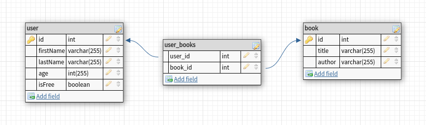

## Entity-Relationship diagram 



## Database

PostgreSQL

Example of creating basic docker container with your password on port 5432.

```bash
docker run \
  -p 5432:5432 \ 
  --name some-postgres \
  -e POSTGRES_PASSWORD=<mysecretpassword> \
  -d \
  postgres
```

After creating postgres replace variables in .env file with consistent data
```dotenv
TYPEORM_HOST=<your-postgres-host>
TYPEORM_PORT=5432
TYPEORM_USERNAME=<your-postgres-user>
TYPEORM_PASSWORD=<your-password>
TYPEORM_DATABASE=<your-database-for-this-project>
```
After first run TypeOrm will create all needed tables

## Installation of project dependencies

To install all dependencies run command below.

```bash
$ npm install
```

## Running the app

App will run on port 3000

```bash
# development
$ npm run start

# watch mode
$ npm run start:dev

# production mode
$ npm run start:prod
```

## Stay in touch

- Author - Saadat Kosumbaeva
- Email - kosumbaevasaadat@gmail.com
